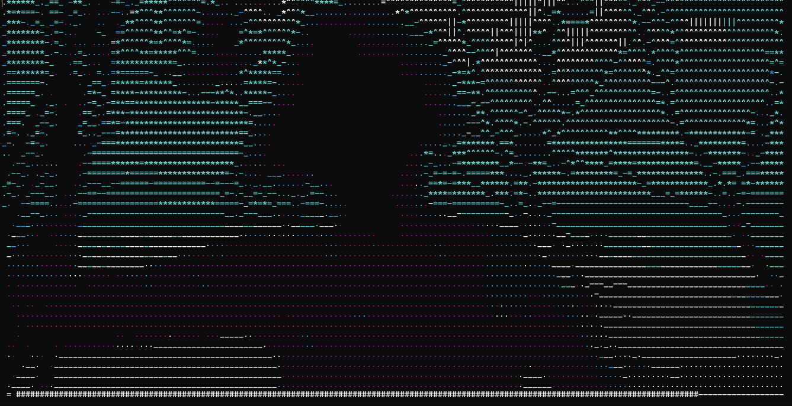

# Terminal Video Player

A video player using ASCII characters to allow you watching videos on the command line.




## Installation

Install the following dependencies with Python:

- Pillow
- MoivePy

**NOTICE** : The application only works on Windows so far.


## Usage

Simply run the following command:

```ps
python player.py <VIDEO_PATH>
```

Press `Q` to quit, `A` to fast backward, `D` to fast forward, `C` to enable/disable color, `P` to pause/play.


## Features

There are already lots of relevant repos on Github. In comparison, this program provides:

- **No preprocessing:** No need to capturing every frame or generate snapshots before playing. The video starts immediately once you run the program.
- **Color support:** It supports 6 colors and more accurate RGB color mapping.
- **High frame rate**: There is no frame rate limit so theoretically it works just as smoothly as the original video (much better than the GIF above).
- **Synchronized time**: Time cost for rendering each frame is recorded to synchronize the video automatically. Thus the soundtrack (if there is any) is in sync with the picture.
- **User control:** There is a progress bar below and user are allowed to pause/play and fast forward/backward the video.
- **Auto resizing:** The program will automatically recognize the window size and adapts to it while playing.


## Limits

PRs are welcomed.

- So far the program haven't support linux. The keyword monitoring for linux haven't been added and the whole program need to be tested.
- MoivePy disables some ANSI escape code for some reason, so it only supports very limited colors. Also color rendering can dramatically degrade the performance.